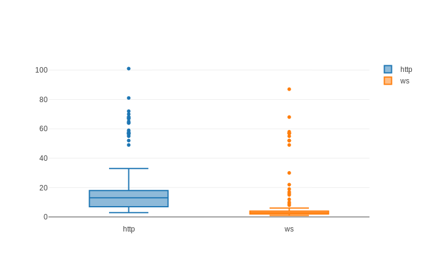

# Chan Ping

Ping from the client to the server, it classical django http views and in channels' AsyncJsonWebsocketConsumer

Draw a box chart from the results.

## Run it:

- with [proxyta.net](proxyta.net)

```
docker-compose up -d
```

- or with pipenv

```
docker run -p 6379:6379 -d redis
pipenv install
pipenv shell
./manage.py migrate
./manage.py runserver
$BROWSER http://localhost:8000
```

## Results


